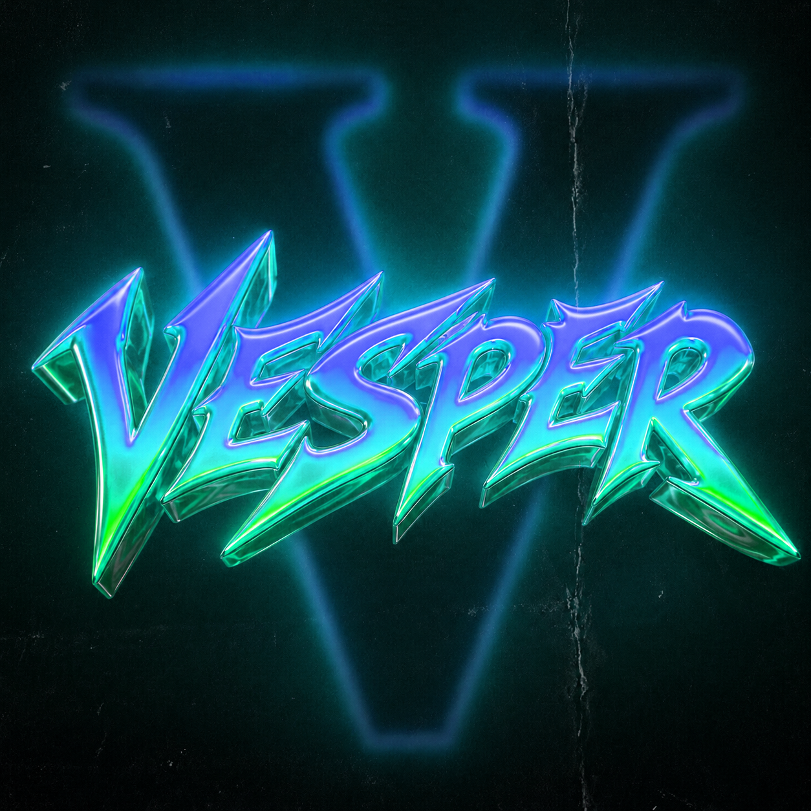

<div align="center">



# Vesper Movies

कंप्यूटर, फोन और टीवी पर फिल्में, सीरीज और लाइव टीवी खोजें, चलाएं और डाउनलोड करें।

[English](README.md) - [Hindi](README_HI.md)

</div>

## किन डिवाइस पर चलता है

- Windows
- Linux
- Android फोन और टैबलेट
- Android TV, Fire TV, Google TV

एक ही कोड, और फोन तथा टीवी दोनों के लिए एक ही APK।

## फीचर

- डिस्कवर पेज, ऊपर बड़ा बैनर और नीचे कतारें, TMDB से या बिना key वाले Cinemeta से
- सारे चालू सोर्स पर एक साथ सर्च
- libmpv वाला बिल्ट-इन प्लेयर
- हर ऑडियो, वीडियो और सबटाइटल ट्रैक दिखता है और चलते-चलते बदला जा सकता है
- सबटाइटल सेटिंग: साइज, रंग, आउटलाइन, बैकग्राउंड, जगह, टाइमिंग
- जहां छोड़ा था वहीं से शुरू
- माय लिस्ट
- डाउनलोड, रोकने और दोबारा शुरू करने के साथ
- किसी भी M3U प्लेलिस्ट से लाइव टीवी
- टीवी पर पूरा D-pad सपोर्ट

## अभी क्या-क्या चलता है

जो अभी काम करता है:

- डिस्कवर, कैटेगरी और सर्च, तीनों असली कैटलॉग डेटा पर
- डिटेल पेज, जिसमें कास्ट, जॉनर, रनटाइम और हर एपिसोड का नाम व थंबनेल
- MovieBox प्लेबैक, उसके Edge-Cache वाले साइन किए DASH मैनिफेस्ट के साथ
- सोर्स से आने वाले सबटाइटल ट्रैक, भाषा के हिसाब से एक-एक करके
- Continue Watching और माय लिस्ट, ऐप बंद करने पर भी सेव
- किसी भी M3U प्लेलिस्ट से लाइव टीवी

जो अभी बाकी है:

- स्ट्रीम सिर्फ MovieBox से आते हैं। 4KHDHub, Dramachi, CircleFTP, DhakaFlix और Stremio ऐड-ऑन के
  लिए ढांचा बना है पर अभी लागू नहीं हुआ
- डाउनलोड स्क्रीन अभी खाली है
- DASH हेडर वाला टेस्ट सिर्फ Windows पर चला है, Linux और Android पर नहीं

## कंट्रोल

| काम | कीबोर्ड | माउस | टच | रिमोट |
|---|---|---|---|---|
| चलाएं / रोकें | Space, K | वीडियो पर क्लिक | बीच में टैप | Center |
| 10 सेकंड पीछे | Left, J | बार खींचें | बाईं तरफ डबल-टैप | Left |
| 10 सेकंड आगे | Right, L | बार खींचें | दाईं तरफ डबल-टैप | Right |
| 60 सेकंड | Shift + तीर | बार पर व्हील | अगल-बगल खींचें | तीर दबाए रखें |
| आवाज | Up / Down | वीडियो पर व्हील | दाईं तरफ ऊपर-नीचे | सिस्टम |
| रोशनी | - | - | बाईं तरफ ऊपर-नीचे | - |
| सबटाइटल | T | आइकन क्लिक | आइकन टैप | Down, फिर आइकन |
| ऑडियो ट्रैक | A | आइकन क्लिक | आइकन टैप | Down, फिर आइकन |
| सबटाइटल टाइमिंग | Z / X | पैनल | पैनल | पैनल |
| रफ्तार | [ / ] | पैनल | दबाए रखें = 2x | पैनल |
| अगला एपिसोड | N | कार्ड क्लिक | कार्ड टैप | Next बटन |
| फुल स्क्रीन | F | डबल-क्लिक | - | हमेशा चालू |
| बाहर निकलें | Esc | - | बैक जेस्चर | Back |

## इंस्टॉल

[latest release](https://github.com/AroseEditor/Vesper-Movies/releases/latest) से डाउनलोड करें।

### Windows

`vesper-movies-windows-x64.zip` अनजिप करें और `vesper_movies.exe` चलाएं। और कुछ नहीं चाहिए।

### Linux

```bash
tar -xzf vesper-movies-linux-x64.tar.gz
./vesper_movies
```

अगर libmpv नहीं है:

```bash
sudo apt install libmpv2 mpv
sudo pacman -S mpv
```

### Android

- ज्यादातर फोन के लिए `vesper-movies-arm64-v8a.apk`
- पुराने 32-बिट फोन के लिए `vesper-movies-armeabi-v7a.apk`

पूछे तो unknown sources से इंस्टॉल की इजाजत दें।

### Android TV, Fire TV, Google TV

वही `vesper-movies-arm64-v8a.apk`। Downloader ऐप या ADB से साइडलोड करें:

```bash
adb connect <device-ip>:5555
adb install vesper-movies-arm64-v8a.apk
```

## बिल्ड

Flutter 3.47 या नया चाहिए।

```bash
git clone https://github.com/AroseEditor/Vesper-Movies.git
cd Vesper-Movies
flutter pub get
flutter run -d windows
```

रिलीज बिल्ड:

```bash
flutter build apk --release --split-per-abi
flutter build windows --release
flutter build linux --release
```

Windows पर पहले Developer Mode चालू करें, वरना बिल्ड symlink नहीं बना पाता:

```
start ms-settings:developers
```

## TMDB key

जरूरी नहीं। बिना key के ऐप Cinemeta इस्तेमाल करता है।

```bash
flutter build apk --release --dart-define=TMDB_API_KEY=your_key_here
```

रिलीज बिल्ड में डाली गई key उस फाइल से निकाली जा सकती है, इसलिए वही key दें जिसके खुलने से फर्क न
पड़े। TMDB की v3 key सिर्फ पढ़ने के लिए होती है और हर key की अपनी लिमिट होती है।

## प्राइवेसी

- कोई telemetry, analytics या crash reporting नहीं
- इस प्रोजेक्ट का अपना कोई सर्वर नहीं
- हिस्ट्री, लिस्ट और सेटिंग्स आपके डिवाइस पर ही रहती हैं
- लॉग में न IP, न सर्च, न प्लेलिस्ट URL, न पूरा रिक्वेस्ट URL
- URL सिर्फ scheme और host तक लिखे जाते हैं
- फाइल पाथ होम फोल्डर के हिसाब से लिखे जाते हैं

स्ट्रीमिंग के लिए उन सर्वरों से बात करनी ही पड़ती है जिन पर कंटेंट है, और उन्हें आपका IP वैसे ही
दिखता है जैसे ब्राउज़र में। दो सोर्स डिजाइन की वजह से लोकल नेटवर्क पर सादे HTTP से चलते हैं और उनकी
इजाजत सिर्फ उन्हीं के पतों तक सीमित है।

## लाइसेंस

MIT। देखें [LICENSE](LICENSE)।

## चेतावनी

यह प्रोजेक्ट कोई मीडिया न रखता है न स्टोर करता है। यह सार्वजनिक स्ट्रीम चलाने वाला क्लाइंट भर है।
अपने देश के कानून का पालन करना आपकी जिम्मेदारी है।
